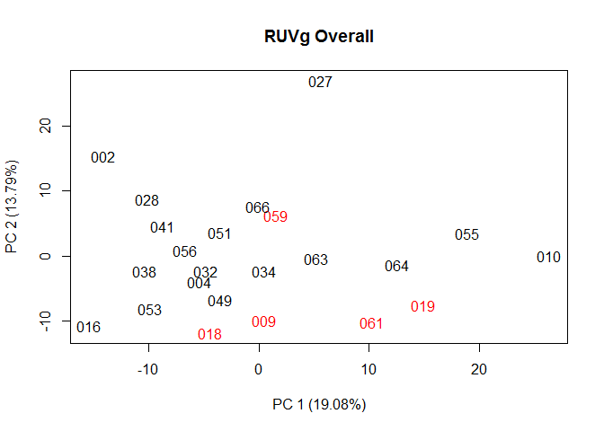
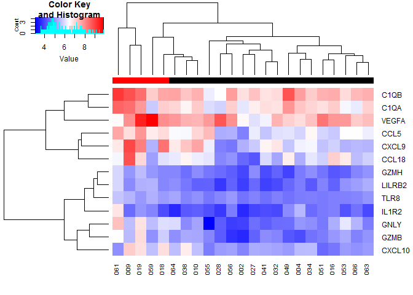
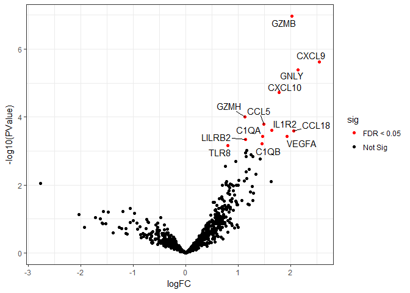

Preparation
-----------

To run the script, please make sure you installed the required packages
first. Many of them are available on
[Bioconductor](https://www.bioconductor.org/install/). The object `raw`
contains the raw data. The object `processed` contains the normalized
data using Nanostring's software. The object `pheno` contains the
phenotypic information.

    library(edgeR)
    library(gplots)
    library(RColorBrewer)
    library(RUVSeq)
    library(ggrepel)

    load(file="data/Nanostring.rda")

Choice of Samples and Models
----------------------------

All samples are included When analyzing the data using Overall response
because there are no unevaluable samples. The overall response status is
binarized such that 0 (PD) and 1 (SD) are grouped into 0; 2 (PR) and 3
(CR) are grouped into 1.

For the raw data, we use the sum rather than average of technical
replicates to avoid 0.5. This is because we use generalized linear model
(GLM) with negative binomial distribution (NB) in the downstream
analysis, which assumes integer counts as input.

    # remove samples with status = 4
    pheno$Overall <- as.numeric(pheno$Overall > 1)

    # avoid 0.5
    raw <- 2*raw

Normalization
-------------

We use RUVg with housekeeping genes as negative controls for
normalization. We have tried other options like TMM, and this is what we
can get best. As shown in PCA plot, PC2 separates patients with
different response status.

    y <- DGEList(counts=raw)
    count <- cpm(y, log=F, prior.count=0, normalized.lib.sizes=T)

    ## housekeeping genes
    hkctr <- rownames(raw)[731:784]
    set1 <- RUVg(as.matrix(log(count)), cIdx=hkctr, k=1, isLog=T)

    my_pca <- function(x, dim1=1, dim2=2, return=F, ...) {
            pca <- prcomp(t(log2(x+1)), center=T, scale=F)
            percent <- pca$sdev^2/sum(pca$sdev^2)*100 
            labs <- sapply(seq_along(percent), function(i) { 
            paste("PC ", i, " (", round(percent[i], 2), "%)", sep="") 
            }) 

            plot(pca$x[, dim1], pca$x[, dim2], type="n", xlab=labs[dim1],
                 ylab=labs[dim2], ...)
            text(pca$x[, dim1], pca$x[, dim2], labels=colnames(x), ...)
            if (return) list(dim1=pca$x[, dim1], dim2=pca$x[, dim2])
    }

    groups <- makeGroups(pheno$Overall)
    set1 <- RUVg(as.matrix(log(count)), cIdx=hkctr, k=1, isLog=T)
    my_pca(exp(set1$normalizedCounts),
                    col=pheno$Overall+1, main="RUVg Overall")

Differential expression
-----------------------

We then fit a GLM using edgeR, and display the results used in the
paper.

    y <- DGEList(counts=raw)
    dmat <- model.matrix(~pheno$Overall+set1$W)

    y <- estimateDisp(y, dmat, robust=T)
    fit <- glmFit(y, dmat)
    lrt <- glmTreat(fit, coef=2, lfc=0)

    ## Zero log2-FC threshold detected. Switch to glmLRT() instead.

    res <- topTags(lrt, n=Inf)
    summary(de <- decideTestsDGE(lrt))

    ##    [,1]
    ## -1    0
    ## 0   771
    ## 1    13

    hmcol <- colorpanel(1000, "blue", "white", "red")
    cols <- palette(brewer.pal(8, "Dark2"))[pheno$Overall+1]
    heatmap.2(set1$normalizedCounts[as.logical(de),], trace="none", col=hmcol, ColSideColors=cols)

    dev.off()

    ## null device 
    ##           1

    label <- rownames(res$table); label[res$table$FDR >= .05] = ""
    res$table$sig <- ifelse(res$table$FDR < .05, "FDR < 0.05", "Not Sig")
    ggplot(res$table, aes(logFC, -log10(PValue), label=label)) + geom_point(aes(col=sig)) + scale_color_manual(values=c("red", "black")) + 
            geom_text_repel() + theme_bw() 

    sessionInfo()

    ## R version 3.4.3 (2017-11-30)
    ## Platform: x86_64-w64-mingw32/x64 (64-bit)
    ## Running under: Windows 7 x64 (build 7601) Service Pack 1
    ## 
    ## Matrix products: default
    ## 
    ## locale:
    ## [1] LC_COLLATE=Chinese (Simplified)_People's Republic of China.936 
    ## [2] LC_CTYPE=Chinese (Simplified)_People's Republic of China.936   
    ## [3] LC_MONETARY=Chinese (Simplified)_People's Republic of China.936
    ## [4] LC_NUMERIC=C                                                   
    ## [5] LC_TIME=Chinese (Simplified)_People's Republic of China.936    
    ## 
    ## attached base packages:
    ## [1] stats4    parallel  stats     graphics  grDevices utils     datasets 
    ## [8] methods   base     
    ## 
    ## other attached packages:
    ##  [1] ggrepel_0.7.0               ggplot2_2.2.1              
    ##  [3] RUVSeq_1.7.4                EDASeq_2.7.2               
    ##  [5] ShortRead_1.31.1            GenomicAlignments_1.9.6    
    ##  [7] SummarizedExperiment_1.3.82 Rsamtools_1.25.2           
    ##  [9] GenomicRanges_1.25.94       GenomeInfoDb_1.9.13        
    ## [11] Biostrings_2.41.4           XVector_0.13.7             
    ## [13] IRanges_2.7.15              S4Vectors_0.11.17          
    ## [15] BiocParallel_1.7.8          Biobase_2.33.3             
    ## [17] BiocGenerics_0.19.2         RColorBrewer_1.1-2         
    ## [19] gplots_3.0.1                edgeR_3.15.2               
    ## [21] limma_3.29.21              
    ## 
    ## loaded via a namespace (and not attached):
    ##  [1] Rcpp_0.12.16            locfit_1.5-9.1         
    ##  [3] lattice_0.20-35         gtools_3.5.0           
    ##  [5] rprojroot_1.2           digest_0.6.10          
    ##  [7] plyr_1.8.4              backports_1.0.3        
    ##  [9] aroma.light_3.3.2       RSQLite_1.0.0          
    ## [11] DESeq_1.25.0            evaluate_0.10          
    ## [13] pillar_1.0.1            rlang_0.3.4            
    ## [15] zlibbioc_1.19.0         GenomicFeatures_1.25.16
    ## [17] lazyeval_0.2.0          annotate_1.51.1        
    ## [19] gdata_2.17.0            R.utils_2.4.0          
    ## [21] R.oo_1.20.0             Matrix_1.2-12          
    ## [23] rmarkdown_1.6           labeling_0.3           
    ## [25] splines_3.4.3           statmod_1.4.26         
    ## [27] geneplotter_1.51.0      stringr_1.2.0          
    ## [29] RCurl_1.95-4.8          biomaRt_2.29.2         
    ## [31] munsell_0.4.3           compiler_3.4.3         
    ## [33] rtracklayer_1.33.12     htmltools_0.3.5        
    ## [35] tibble_1.4.1            matrixStats_0.51.0     
    ## [37] XML_3.98-1.4            MASS_7.3-47            
    ## [39] bitops_1.0-6            R.methodsS3_1.7.1      
    ## [41] grid_3.4.3              xtable_1.8-2           
    ## [43] gtable_0.2.0            DBI_0.5-1              
    ## [45] magrittr_1.5            scales_0.5.0           
    ## [47] KernSmooth_2.23-15      stringi_1.1.2          
    ## [49] hwriter_1.3.2           genefilter_1.55.2      
    ## [51] latticeExtra_0.6-28     tools_3.4.3            
    ## [53] survival_2.41-3         yaml_2.1.13            
    ## [55] AnnotationDbi_1.35.4    colorspace_1.2-7       
    ## [57] caTools_1.17.1          knitr_1.18

References:
-----------

1.  Risso, D., et al., Normalization of RNA-seq data using factor
    analysis of control genes or samples. Nat Biotechnol, 2014.
    32(9): p. 896-902.
2.  McCarthy, D.J., Y. Chen, and G.K. Smyth, Differential expression
    analysis of multifactor RNA-Seq experiments with respect to
    biological variation. Nucleic Acids Res, 2012. 40(10): p. 4288-97.
